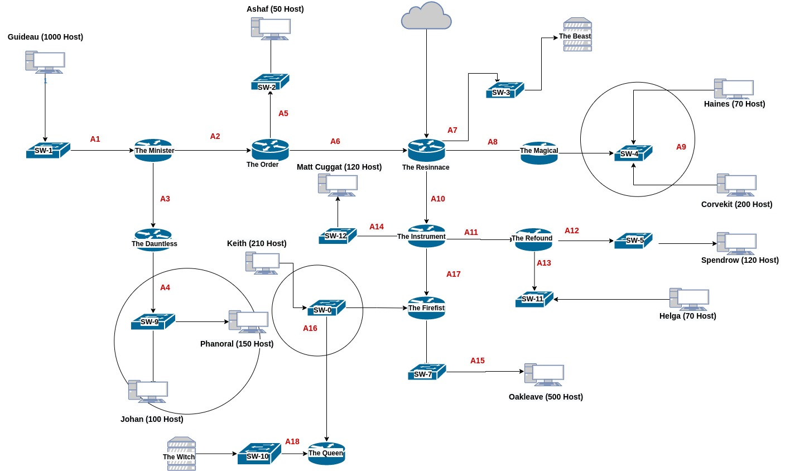

# Jarkom-Modul-4-D14-2022

Lapres Praktikum Jarkom Modul 4 Kelompok D-14

| Nama                      | NRP      |
|---------------------------|----------|
|Gloriyano C. Daniel Pepuho |5025201121|

## Cara Pengerjaan

## VLSM

|Node                       | Alokasi      |  Netmask   |
|---------------------------|--------------|------------|
|A1                         |1001          | /22        |
|A2                         |2             | /30        |
|A3                         |2             | /30        |
|A4                         |251           | /24        |
|A5                         |51            | /26        |
|A6                         |2             | /30        |
|A7                         |2             | /30        |
|A8                         |2             | /30        |
|A9                         |271           | /23        |
|A10                        |2             | /30        |
|A11                        |2             | /30        |
|A12                        |121           | /25        |
|A13                        |71            | /25        |
|A14                        |121           | /25        |
|A15                        |501           | /30        |
|A16                        |254           | /24        |
|A17                        |2             | /30        |
|A18                        |2             | /30        |
|Jumlah                     |2618          | /20        |

## Inventory

|Node                       |  Interface   |  IP               |
|---------------------------|--------------|-------------------|
|The Minister               | Fa1/0        | 192.192.1.1/22    |
|                           | Fa0/0        | 192.192.11.193/30 |
|                           | Fa2/0        | 192.192.11.197/30 |
|The Dauntless              | Fa1/0        | 192.192.8.1/24    |
|                           | Fa2/0        | 192.192.11.198/30 |
|The Order                  | Fa0/0        | 192.192.11.194/30 |
|                           | Fa1/0        | 192.192.11.129/26 |
|                           | Fa2/0        | 192.192.11.201/30 |
|The Ressinance             | Fa0/0        | 192.192.11.213/30 |
|                           | Fa2/0        | 192.192.11.202/30 |
|                           | Fa3/0        | 192.192.11.209/30 |
|                           | Fa4/0        | 192.192.11.205/30 |
|The Magical                | Fa1/0        | 192.192.6.1/23    |
|                           | Fa3/0        | 192.192.11.210/30 |
|The Instrument             | Fa0/0        | 192.192.11.214/30 |
|                           | Fa1/0        | 192.192.11.1/25   |
|                           | Fa2/0        | 192.192.11.221/30 |
|                           | Fa3/0        | 192.192.11.218/30 |
|The Firefist               | Fa0/0        | 192.192.9.1/24    |
|                           | Fa1/0        | 192.192.4.1/23    |
